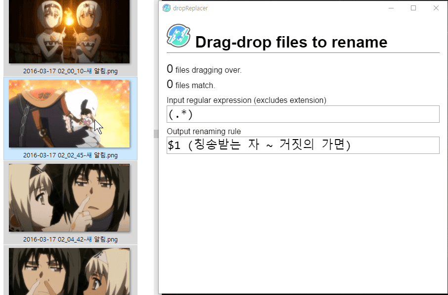

# dropReplacer

Rename drag-dropped files by regular expression (regex).

A simple electron app. currently tested only on windows.

Caution: It preserves file extension.

# todo
- [x] Basic oh basic feature
  - [x] drag-drop
  - [x] rename by regex
- [x] Show dragging files match info
  - [ ] fix flickering number issues due to events of child elements
- [ ] Check regex
  - [ ] highlight regex
    - [x] brace
    - [x] escape sequence - basic
  - [ ] is valid regex?
  - [ ] is valid file name?
  - [ ] escape invalid renaming rules to right ones
- [ ] A neat progress bar
- [x] Cleaner look
- [ ] Log renamed files
- [ ] Undo
  - [ ] undo with main UI
  - [ ] undo with Ctrl - Z
- [ ] Resize images to fit below specific size?
- [x] Icon for packaged binary

# dev

only some npm commands.

- `npm start` : Test. run `electron-prebuilt` for testing app.
- `npm run build` : Make excutables. run `electron-packager` for windows.

# etc

Yes, It's just a program for tagging anime-names into anime-captured images! XD
